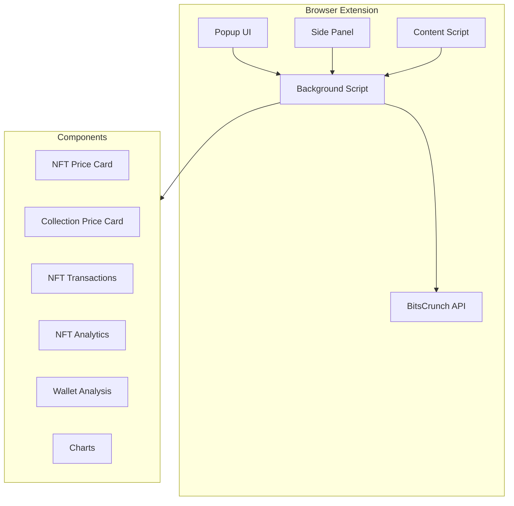

# BitsCrunch NFT Analytics Extension 🚀

<div align="center">


A powerful browser extension for real-time NFT analytics and market insights, powered by BitsCrunch API.

[](https://www.typescriptlang.org/)
[](https://reactjs.org/)
[](https://tailwindcss.com/)
[](https://vitejs.dev/)

</div>

## 🌟 Features

- **Real-time NFT Analytics**: Get instant insights into NFT valuations and market trends
- **Multi-chain Support**: Analytics across different blockchain networks
- **Price Estimation**: Advanced AI-powered price predictions
- **Market Analysis**: Comprehensive market trend analysis
- **Trader Insights**: Detailed trader activity metrics
- **Wash Trade Detection**: Sophisticated wash trading analysis
- **Transaction History**: Complete transaction tracking
- **Collection Analytics**: Collection-wide price analysis
- **Interactive Charts**: Dynamic data visualization
- **Custom Time Ranges**: Flexible time period selection

## 🏗️ Architecture



## 🛠️ Technical Stack

- **Frontend Framework**: React 18.3 with TypeScript
- **Build Tool**: Vite 6.0
- **Styling**: 
  - Tailwind CSS 3.4
  - shadcn/ui components
  - Radix UI primitives
- **Data Visualization**: 
  - Recharts for interactive charts
  - Custom chart components
- **State Management**: React Hooks and Context
- **API Integration**: Axios for data fetching
- **Development**:
  - ESLint 9.17 for code quality
  - TypeScript 5.6 for type safety

## 📦 Installation

1. Clone the repository:
```bash
git clone https://github.com/yourusername/bitscrunch-nft-extension.git
```

2. Install dependencies:
```bash
cd bitscrunch-nft-extension
npm install
```

3. Build the extension:
```bash
./build-extension.sh
```

4. Load the extension in Chrome:
   - Open Chrome and navigate to `chrome://extensions/`
   - Enable "Developer mode"
   - Click "Load unpacked"
   - Select the `dist` folder from your build

## 🔧 Project Structure

```plaintext
bitscrunch-nft-extension/
├── src/
│   ├── components/
│   │   ├── Chart.tsx
│   │   ├── NftAnalytics.tsx
│   │   ├── NftPriceCard.tsx
│   │   ├── NftCollectionPriceCard.tsx
│   │   ├── NftTransaction.tsx
│   │   ├── NftTraders.tsx
│   │   ├── WalletAnalysis.tsx
│   │   └── ui/
│   ├── hooks/
│   │   └── useChromeExtension.ts
│   ├── data/
│   │   └── DataLists.ts
│   ├── types/
│   │   └── chrome.d.ts
│   └── App.tsx
├── public/
│   ├── manifest.json
│   ├── background.js
│   └── content-script.js
└── package.json
```

## 🔑 API Integration

The extension integrates with the UnleashNFTs API for comprehensive NFT analytics:

- `/api/v2/nft/blockchains` - Supported blockchain networks
- `/api/v2/nft/market-trend` - Market trend data
- `/api/v2/nft/traders` - Trader activity metrics
- `/api/v2/nft/washtrade` - Washtrade pattern analysis
- `/api/v2/nft/price-estimate` - NFT price estimations
- `/api/v2/nft/collection-price-estimate` - Collection price analysis
- `/api/v2/nft/transactions` - Transaction history

## 🔐 Security

- API keys are securely stored in Chrome's storage API
- CORS policies properly configured for API requests
- Content Security Policy (CSP) implemented
- No sensitive data exposed in the codebase

## 🌐 Browser Support

- Chrome (v114+)
- Brave (v114+)
- Edge (v114+)
- Other Chromium-based browsers (v114+)

## 🤝 Contributing

1. Fork the repository
2. Create your feature branch (`git checkout -b feature/AmazingFeature`)
3. Commit your changes (`git commit -m 'Add some AmazingFeature'`)
4. Push to the branch (`git push origin feature/AmazingFeature`)
5. Open a Pull Request

## 📄 License

This project is licensed under the MIT License - see the [LICENSE](LICENSE) file for details.

## 🙏 Acknowledgments

- Built with [BitsCrunch](https://www.bitscrunch.com/) API
- UI components powered by shadcn/ui
- Charts and visualizations using Recharts
