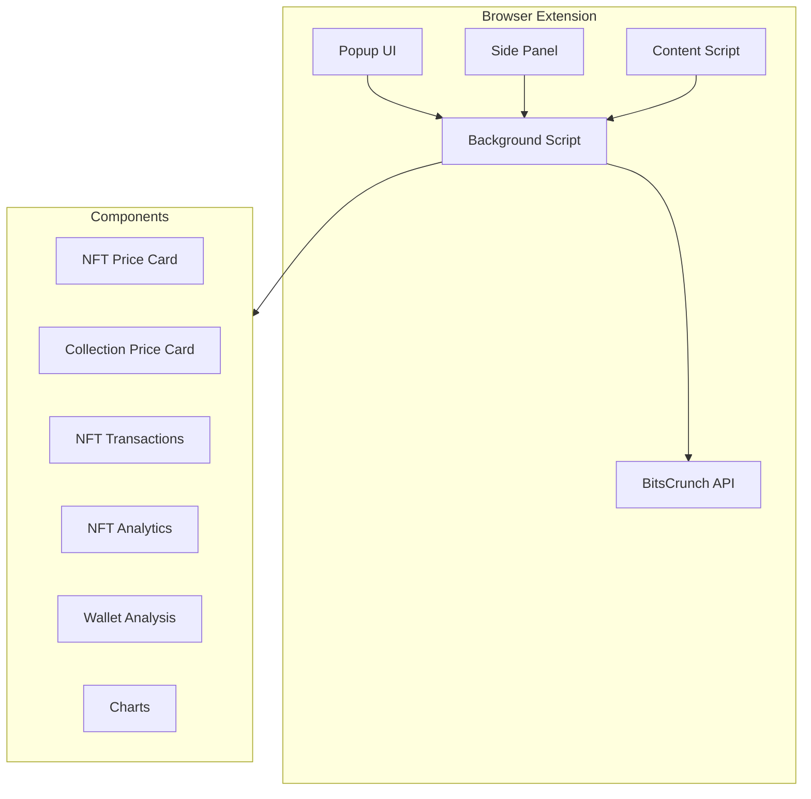

# BitsCrunch Browser AI Copilot 🚀

<div align="center">


A powerful Browser integrated Persistent SidePanel for real-time AI Piloted NFT analytics and market insights, powered by BitsCrunch API.
Side-panel · 31 BitsCrunch endpoints · AI copilot for instant insights.

[](https://www.typescriptlang.org/)
[](https://reactjs.org/)
[](https://tailwindcss.com/)
[](https://vitejs.dev/)

</div>

## 🌟 Features


- **Real-time NFT Analytics**: Get instant insights into NFT valuations and market trends
- **Multi-chain Support**: Analytics across different blockchain networks
- **Price Estimation**: Advanced AI-powered price predictions
- **Market Analysis**: Comprehensive market trend analysis
- **Trader Insights**: Detailed trader activity metrics
- **Wash Trade Detection**: Sophisticated wash trading analysis
- **Transaction History**: Complete transaction tracking
- **Collection Analytics**: Collection-wide price analysis
- **Interactive Charts**: Dynamic data visualization
- **Custom Time Ranges**: Flexible time period selection

--

## 🏗️ Architecture




- **Content Script** grabs NFT details from OpenSea pages.
- **Service Worker** relays data, stores API key (Chrome `storage.local`).
- **React 18 + Vite** renders tabs, queues API calls, caches responses (5-30 min).
- **Tailwind + shadcn/ui + Recharts** for sharp cards & charts.

--

## 🛠️ Technical Stack


- **Frontend Framework**: React 18.3 with TypeScript
- **Build Tool**: Vite 6.0
- **Styling**:
  - Tailwind CSS 3.4
  - shadcn/ui components
  - Radix UI primitives
- **Data Visualization**:
  - Recharts for interactive charts
  - Custom chart components
- **State Management**: React Hooks and Context
- **API Integration**: Axios for data fetching
- **Development**:
  - ESLint 9.17 for code quality
  - TypeScript 5.6 for type safety


--

## 📦 Installation

1. Clone the repository:

```bash
git clone https://github.com/yourusername/bitscrunch-nft-extension.git
```

2. Install dependencies:

```bash
cd bitscrunch-nft-extension
npm install
```

3. Build the extension:

```bash
./build-extension.sh
```

4. Load the extension in Chrome:
   - Open Chrome and navigate to `chrome://extensions/`
   - Enable "Developer mode"
   - Click "Load unpacked"
   - Select the `dist` folder from your build

--

## 🔧 Project Structure


```plaintext
bitscrunch-nft-extension/
├── src/
│   ├── components/
│   │   ├── Chart.tsx
│   │   ├── NftAnalytics.tsx
│   │   ├── NftPriceCard.tsx
│   │   ├── NftCollectionPriceCard.tsx
│   │   ├── NftTransaction.tsx
│   │   ├── NftTraders.tsx
│   │   ├── WalletAnalysis.tsx
│   │   └── ui/
│   ├── hooks/
│   │   └── useChromeExtension.ts
│   ├── data/
│   │   └── DataLists.ts
│   ├── types/
│   │   └── chrome.d.ts
│   └── App.tsx
├── public/
│   ├── manifest.json
│   ├── background.js
│   └── content-script.js
└── package.json
```

--

## 🔑 API Integration


The extension integrates with the UnleashNFTs API for comprehensive NFT analytics: 🔌 BitsCrunch Endpoints Used (31)

| Purpose                                          | Endpoint                                            |
| ------------------------------------------------ | --------------------------------------------------- |
| Blockchains list                                 | `GET /api/v2/blockchains`                           |
| Market trend                                     | `GET /api/v1/market/trend`                          |
| NFT price                                        | `GET /api/v2/nft/liquify/price_estimate`            |
| Collection price                                 | `GET /api/v2/nft/liquify/collection/price_estimate` |
| NFT analytics                                    | `GET /api/v2/nft/analytics`                         |
| NFT scores                                       | `GET /api/v2/nft/scores`                            |
| Holder data                                      | `GET /api/v2/nft/owner`                             |
| NFT washtrade                                    | `GET /api/v2/nft/washtrade`                         |
| NFT traders (snapshot)                           | `GET /api/v2/nft/traders`                           |
| NFT traders (trend)                              | `GET /api/v2/nft/market-insights/traders`           |
| NFT transactions                                 | `GET /api/v2/nft/transactions`                      |
| Chain washtrade trend                            | `GET /api/v2/nft/market-insights/washtrade`         |
| Wallet NFT balance                               | `GET /api/v2/wallet/balance/nft`                    |
| Wallet token balance                             | `GET /api/v2/wallet/balance/token`                  |
| Wallet label                                     | `GET /api/v2/wallet/label`                          |
| Wallet score                                     | `GET /api/v2/wallet/score`                          |
| Wallet metrics                                   | `GET /api/v2/wallet/metrics`                        |
| Wallet NFT analytics                             | `GET /api/v2/nft/wallet/analytics`                  |
| Wallet NFT traders                               | `GET /api/v2/nft/wallet/traders`                    |
| … plus 12 auxiliary paginated /timespan variants |                                                     |

--

## 🔒 Security Notes

- **Keys never leave your device.** BitsCrunch key in `storage.local`; OpenAI key kept in memory per session.
- Strict CSP & host-permissions (`api.unleashnfts.com`, `openai.com`, `opensea.io`).
- No third-party tracking.

--

## 🌐 Browser Support


- Chrome (v114+)
- Brave (v114+)
- Edge (v114+)
- Other Chromium-based browsers (v114+)

--

## 🗂️ Key React Components

| File                          | Responsibility                   | Main APIs                           |
| ----------------------------- | -------------------------------- | ----------------------------------- |
| `NftPriceCard.tsx`            | Liquify price, AI chat           | price_estimate                      |
| `NftCollectionPriceCard.tsx`  | Collection valuation             | collection/price_estimate           |
| `NftTransaction.tsx`          | Tx table + chart, AI             | transactions                        |
| `NftTraders.tsx`              | Buyer/seller stats, chart        | traders, traders trend              |
| `NftAnalytics.tsx`            | Perf, volume, wash, holder       | analytics, scores, owner, washtrade |
| `WalletAnalysis.tsx`          | Portfolio dashboard, AI          | wallet \* endpoints                 |
| `hooks/useChromeExtension.ts` | Tabs, storage, sidepanel helpers | –                                   |

--

## 🤝 Contributing

1. Fork the repository
2. Create your feature branch (`git checkout -b feature/AmazingFeature`)
3. Commit your changes (`git commit -m 'Add some AmazingFeature'`)
4. Push to the branch (`git push origin feature/AmazingFeature`)
5. Open a Pull Request

--

## 📄 License

This project is licensed under the MIT License - see the [LICENSE](LICENSE) file for details.

--

## 🙏 Acknowledgments

- Built with [BitsCrunch](https://www.bitscrunch.com/) API
- OpenAI api - gpt-4o-mini
- UI components powered by shadcn/ui
- Charts and visualizations using Recharts
